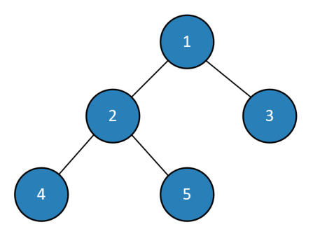

# Binary Search Tree Iterators

All of the Iterators implemented in this library "flatten" the binary search tree at the time of construction of the enuermator class. That means there is a shallow copy made of all the nodes in the order in which they will be traversed to a seperate collection.

There are several iterators available that traverse the tree using different methods:

* [In Order](.\Reference\TheCodingMonkey.Collections.BST\InOrderFlatEnumerator-2.md) - Default Enumerator - Traverses the tree in sorted order according to the Key Value.
* [Pre-Order](.\Reference\TheCodingMonkey.Collections.BST\PreOrderFlatEnumerator-2.md) - Traverses the tree in the node order according to Left, Root, Right.
* [Post-Order](.\Reference\TheCodingMonkey.Collections.BST\PostOrderFlatEnumerator-2.md) - Traverses the tree in the node order according to Root, Left, Right.
* [Level Order](.\Reference\TheCodingMonkey.Collections.BST\LevelOrderFlatEnumerator-2.md) - Traverses the tree breadth first



For a Binary Search Tree with the nodes as defined above, the different iterators will traverse in the following orders:

* In Order: 4, 2, 5, 1, 3
* Pre-Order: 1, 2, 4, 5, 3
* Post-Order: 4, 5, 2, 3, 1
* Level Order: 1, 2, 3, 4, 5

Each of the Binary Search Tree implementations return an [InOrderFlatEnumerator](.\Reference\TheCodingMonkey.Collections.BST\InOrderFlatEnumerator-2.md) as the default implemenation of [`IEnumerable.GetEnumerator()`](https://docs.microsoft.com/en-us/dotnet/api/system.collections.ienumerable.getenumerator).

Sample:
```csharp
    var bst = new AVLTree<int, int>()
    {
        { 1, 1 },
        { 2, 2 },
        { 3, 3 },
        { 4, 4 },
        { 5, 5 },
    };

    Console.Write("In Order: ");
    foreach (var inorder in bst)
        Console.Write($"{inorder.Key} ");

    Console.Write("\nPre Order: ");
    var preorder = new PreOrderFlatEnumerator<int, int>(bst);
    while(preorder.MoveNext())
        Console.Write($"{preorder.Current.Key} ");

    Console.Write("\nPost Order: ");
    var postorder = new PostOrderFlatEnumerator<int, int>(bst);
    while (postorder.MoveNext())
        Console.Write($"{postorder.Current.Key} ");

    Console.Write("\nLevel Order: ");
    var levelorder = new LevelOrderFlatEnumerator<int, int>(bst);
    while (levelorder.MoveNext())
        Console.Write($"{levelorder.Current.Key} ");
```

Output:
```
In Order: 1 2 3 4 5 
Pre Order: 2 1 4 3 5 
Post Order: 1 3 5 4 2 
Level Order: 2 1 4 3 5
```